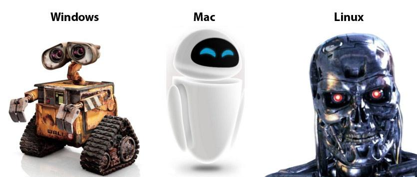

<!--
espresso
zenburn
monochrome
kate
haddock
breezedark
tango
pygments
null
-->

<!--
Owes a lot to:
https://kbroman.org/blog/2013/10/07/better-looking-latexbeamer-slides/
-->


```{r setup, include=FALSE}
#https://stackoverflow.com/questions/25646333/code-chunk-font-size-in-rmarkdown-with-knitr-and-latex/46526740#46526740
def.chunk.hook  <- knitr::knit_hooks$get("chunk")
knitr::knit_hooks$set(chunk = function(x, options) {
  x <- def.chunk.hook(x, options)
  ifelse(options$size != "normalsize", paste0("\\", options$size,"\n\n", x, "\n\n \\normalsize"), x)
})
# these two lines may/may not be necessary
knitr::opts_chunk$set(echo = FALSE)
library(knitr)
```

```{r hbarplot, include=T, echo=F}
#' Concatenates bar name and value
#'
getNewNames <- function(df, valueString, nameString, suffix="", digits=NA){
    newName <- df[[nameString]]
    val <- df[[valueString]]
    if (is.numeric(digits)){
        fmt <- paste0("%.", digits, "f")
        val <- sprintf(fmt, val)
    }

    n <- length(newName)
    for (i in seq_len(n)){
        newName[i] <- paste0(newName[i], "   ", val[i], suffix)
    }
    return(newName)
}


#' A nice horizontal bar plot
#'
#' Uses ggplot to make nice horizontal bar plot
#'
#' @param df A data frame, where the first column is the names and second 
#'           column is the values. Order of the names matters; will display
#'           names top to bottom.
#'
#' @param plot.theme Either \code{"light"} (default) or \code{"dark"}.
#'
#' @param bar.theme One of 
#'               \code{c("red", "orange", "yellow", "blue", "green", "purple")}.
#'               If not one of these, then will use \code{"blue"} (default).
#'
#' @param xlab x-axis label; default is \code{NULL}, which is empty.
#'
#' @param ylab y-ayis label; default is \code{NULL}, which is empty.
#'
#' @param ylab title label; default is \code{NULL}, which is empty.
#'
#' @param suffix Character string that will be appended to new names.
#'               Default is \code{""}.
#'
#' @param x.text.size Size of text on x-axis. Default is code{8}.
#'
#' @param y.text.size Size of text on y-axis. Default is code{10}.
#'
#' @param title.text.size Size of text on titleaxis. Default is code{14}.
#'
#' @param text.face One of \code{c("plain", "italic", "bold", "bold.italic")}. 
#'                  Default is \code{"bold"}.
#'
#' @param useNewNames If \code{TRUE} (default), will add value of bar to the 
#'                    bar name.
#'
#' @param uselog If \code{TRUE} (default is \code{FALSE}), will log the 
#'               x-axis scale.
#'
#' @param digits Number of digits for rounding values for new names.
#'
#' @param x.axis.show If \code{TRUE} (default is \code{FALSE}), will show
#'               the x-axis tick marks and values.
#'
gghbar <- function(df=data.frame(names=c("Z", "X", "Y"), values=c(12, 10, 5), 
                                 stringsAsFactors=F), 
                   plot.theme="light", 
                   bar.theme="blue", 
                   bar.width=0.5,
                   xlab=NULL, 
                   ylab=NULL, 
                   title=NULL, 
                   suffix="",
                   x.text.size=8,
                   y.text.size=10, 
                   title.text.size=14, 
                   text.face="bold", 
                   useNewNames=T, 
                   uselog=F,
                   digits=NA,
                   x.axis.show=F){

    # load ggplot2
    suppressMessages(require(ggplot2))
    df <- df[rev(seq_len(nrow(df))), ]
    if (useNewNames){
        newName <- getNewNames(df, names(df)[2], names(df)[1], suffix=suffix, digits=digits)
        df[[1]] <- newName
    }
    names(df) <- c("namesCol", "valuesCol")

    backcol <- NA
    textcol <- "black"
    if (plot.theme == "dark"){
        backcol <- "#181818"
        textcol <- "#FFFFFF"
    } 

    #mycol <- "#69b3a2"
    # BLUE is default
    fillCol <- "#4da6ff"
    outCol <- "#1a8cff"
    # lightblue <- "#4da6ff"
    # darkblue <- "#1a8cff"

    if ( bar.theme=="red" ){
        fillCol <- "#F03838"
        outCol <- "#D02F2F"
    }

    if ( bar.theme=="orange" ){
        #fillCol <- "#FF9933"
        fillCol <- "#FF8000"
        outCol <- "#CC6600"
    }

    if ( bar.theme=="yellow" ){
        fillCol <- "#FFFF00"
        outCol <- "#CCCC00"
    }

    if ( bar.theme=="green" ){
        fillCol <- "#3BD464"
        outCol <- "#26A548"
    }

    if ( bar.theme=="blue" ){
        fillCol <- "#4da6ff"
        outCol <- "#1a8cff"
    }

    if ( bar.theme=="purple" ){
        fillCol <- "#7F00FF"
        outCol <- "#6600CC"
    }

#    mywidth <- 0.5
    #backcol <- "black"
    #textcol <- "white"
    #backcol <- "white"
    #textcol <- "black"
    #ylabstring <- NULL
#    ylab <- "87,317 responses; select all that apply "
#    xlabstring <- NULL
    p <- ggplot(df, aes(namesCol, valuesCol)) + geom_col(fill=fillCol, color=outCol, width=bar.width) 
    p <- p + xlab(xlab) + ylab(ylab) + ggtitle(title)
    p <- p + coord_flip()
    p <- p  + scale_x_discrete(limits = df$namesCol)
    p <- p + theme_classic()

    p <- p + theme(axis.text.y = element_text(colour=textcol, size=y.text.size, face=text.face, margin=margin(0,0,0,0,"cm")),
                   axis.title.x = element_text(colour = textcol, size=x.text.size),
                   title = element_text(colour = textcol, size=title.text.size),
                   plot.background = element_rect(fill = backcol, color=NA), 
                   #plot.background = element_rect(fill = backcol), 
                   panel.background = element_rect(fill = backcol),
                   axis.ticks.y = element_blank(),   
                   axis.line.y = element_blank())

    if (uselog){
        p <- p + scale_y_log10()
#        p <- p + scale_y_continuous(trans='log10')
    }

    if (x.axis.show==F){
        p <- p + theme( axis.text.x = element_blank(), 
                        axis.ticks.x = element_blank(), 
                        axis.line.x = element_blank())
    } else {
        p <- p + theme( axis.text.x = element_text(colour=textcol), 
                        axis.ticks.x = element_line(colour=textcol), 
                        axis.line.x = element_line(colour=textcol) )
    }
    return(p)
}

#' Sample data, from Stackoverflow
#' 
#' A dataframe containing a selection of development environments
#' and the proportion of users who use them
#' 
getIDEData <- function(){
    dfstring <- 
        "VisualStudioCode,50.7\n
    VisualStudio,31.5\n
    Notepad++,30.5\n
    Vim,25.4\n
    SublimeText,23.4\n
    Eclipse,14.4\n
    PyCharm,13.4\n
    Atom,13.3\n
    IPython/Jupyter,9.5\n
    Emacs,4.5\n
    RStudio,3.4\n
    TextMate,0.9\n"

    #df <- read.table(file=filename, header=F, sep=",", stringsAsFactors=F)
    df <- read.table(text=dfstring, header=F, sep=",", stringsAsFactors=F)
    names(df) <- c("ide", "perc")
    return(df)
}

```


## Overview 

A collection of tools and tips to make:  

- Developing your statistical software
- Publishing your code
- Writing your thesis and papers

easier, more efficient --- and even fun.


## Towards better Science

Using these tools and approaches will allow one to:


- Become more efficient on a computer <!--while working on a computer-->
- Write better code <!--with fewer bugs-->
- Create more reproducible research

<!-- Ultimately: do better science-->

<!-- - do better science-->


## Disclaimer

 - Just my opinion
 - I am not an expert 
 - These are just **suggestions**
 - There are lots of other options
 - Many of these may seem obvious

I hope you will find **one** suggestion today that is of interest to you

<!--
 - These tools have helped me
 - I use all of these tools regularly
 - as you encounter problems, you will have the solution available, what can be done, what should be done
-->

<!--
> - Just my opinion
> - I am not an expert developer
> - There are lots of other options
> - These tools have helped me
> - I use these tools daily
-->


# 1. Use a Unix-based OS  


## Two popular distributions:  


* Linux (many versions)
* OSX

\

Everything you see today is free and works with both.


## Why use Unix?


{ height=10cm }

source: [imgur.com](https://imgur.com/gallery/5HqtRyz)

<!--
with Figure 1: 
](fig/windows_vs_mac_vs_linux.jpg){ height=10cm }
-->


## Why use Unix?

- The power of the command line tools:
    - `ssh`
    - `grep` 
    - `find` 
    - `wget`
    - `aspell` (LaTeX spellcheck)
    - `top`
- These tools can be 'piped' together
    - e.g. find all files containing word $X$, made after date $Y$
- **Shell script**: a single file that runs multiple commands/scripts
- Don't know how to use a tool?
    - `man grep`

- Windows users: Cygwin


## Useful example

 ```
grep --include=*.{Rmd,R} -rnw '.' -e "Linux"
 ```

```{r, engine='bash', echo = TRUE, comment="", size = "small", collapse=T}
grep --include=*.{Rmd,R} -rnw '.' -e "Linux"
```


## Different flavours of Linux


<!--
No Mac? No worries
-->

{ height=6cm }

source: [distrowatch.com, October 2019, top 10 of approx. 200](https://distrowatch.com/dwres.php?resource=popularity)


## 

{ height=7cm }

Cinnamon, source: [linuxmint.com](https://www.linuxmint.com/)


## Try it out

- Live USB - let's you test it out before installing
    - check wifi 
    - check sound
    - check video
    - check filesystem
- Virtual machine: VirtualBox


## Starting out?


- Consider starting with:
    - Mint (Ubuntu), Cinnamon
    - Manjaro KDE
- Loads of software, users, support


<!--
- Different backends:
    - Ubuntu
    - Arch

- Different frontends:
    - Cinnamon
    - Xfce
    - KDE
-->


# 2. Pick a good editor

## Most Popular Development Environments


```{r ideplot}
suppressMessages(require(ggplot2))
require(ggplot2)
dfstring <- 
    "VisualStudioCode,50.7\n
VisualStudio,31.5\n
Notepad++,30.5\n
Vim,25.4\n
SublimeText,23.4\n
Eclipse,14.4\n
PyCharm,13.4\n
Atom,13.3\n
IPython/Jupyter,9.5\n
Emacs,4.5\n
RStudio,3.4\n
TextMate,0.9\n"

#df <- read.table(file=filename, header=F, sep=",", stringsAsFactors=F)
df <- read.table(text=dfstring, header=F, sep=",", stringsAsFactors=F)
names(df) <- c("ide", "perc")

ylabstring <- "87,317 responses; select all that apply "
p <- gghbar(df=df, plot.theme="dark", ylab=ylabstring, suffix="%")
print(p)

```
source: [Stackoverflow  Developer Survey 2019](https://insights.stackoverflow.com/survey/2019)


## Desirable editor features

  - Cross platform 
  - Multi-language support
    - Python, R, C++, etc
    - LaTeX 
  - If not command line-based editor, become familiar with one 
    - e.g. nano, Vim, Emacs
     


# 3. Use a terminal multiplexer


## Terminal multiplexers

- `screen` (classic, but no longer maintained)
- `tmux` (new and growing in popularity)


## `tmux` benefits

- Organise multiple terminals in one screen\*
- Easily split windows into panes\*
- Continue server sessions\* 
- Pane shading 
- Save sessions after reboots: [tmux-resurrect](https://github.com/tmux-plugins/tmux-resurrect)

\*also `screen`


<!--
## Easy to install


Linux (Ubuntu):
 ```
sudo apt-get install tmux
 ```

OSX (with `homebrew`):
 ```
brew install tmux
 ```

 \

Check it is installed correctly (and version): `tmux -V`


(Oct 2019: will install version $\geq 2.9$)
-->


## `tmux` demo

\begin{center}
\animategraphics[loop,width=0.8\linewidth]{4}{fig/tmuxdemo/pngout-}{0}{59}
\end{center}


# 4. Use the server


## Easily run large-scale simulations

- Your local machine is for **development**
- Queue a job on the server, and let it run overnight
- This is where knowing:
    - terminal commands
    - Vim/Emacs
    - `screen`/`tmux`  
  will pay off **A LOT**.
- If no queueing system, try `nohup`
    - Example: `nuhup CMD bg &`, where `CMD` is the command to be run 


# 5. Use Git

## Git: version control

 - Ever had code (R, C++, LaTeX...) 'stop working'?
 - Git allows you to easily create checkpoints and versions
 - Developed by Linus Torvalds (Linux)
 - Git is FAST
 - Allows you to work offline
 - There are other version control systems, but Git is most popular


## Git: basic commands 

- Quick and easy to get started:
    - `git init`
    - `git add .`
    - `git commit`
- Recovering versions is also easy
    - Three different methods, depending on situation


## Git demo


\begin{center}
\animategraphics[loop,width=0.8\linewidth]{4}{fig/gitdemo/pngout-}{0}{57}
\end{center}


## Git for backups

- Ever worried about backing up scripts?
- Get a free GitHub or Bitbucket account
    - upload Git repo's with: `git push -u origin master`
- Lost your code or want to sync on a different computer?
    - `git clone`
    - `git pull`


## Using Git

- Use Git for version control with:
    - code scripts
    - LaTeX scripts

- Do not use Git with:
    - data files
- Can use it to save images, but be careful. Try `git-lfs`

- Create a `.gitignore` file to ignore certain file(type)s

- Can be used for team-based projects


<!--
## Installing Git

Linux: 
 ```
sudo apt-get install git
 ```

OSX: 
 ```
brew install git
 ```

-->


# 6. Create R packages, not scripts

## R packages

- Binds your scripts together
- Forces you to comment/document your code
- Easily integrate **tests** (more later)
- Getting started: `devtools` and `roxygen2` packages
- Check out [Hadley Wickham's online book](http://r-pkgs.had.co.nz/intro.html)
- **Note:** similar in Python

<!--
- Similar: Python packages  
  -->


# 7. Comment your code

## Two types of comments

  - Code description (documentation)
     - show users how to use functions
     - input, output, what the function does
     - part of `roxygen2` commands
  - Algorithmic description
     - for others (and yourself!) to understand the code
     - inside the functions
     - explain why you did something in a certain way, e.g.
        - `# using a matrix here because...`


Seems annoying and time-consuming - but the payoff is **worth it**

(ever come back to code after a couple of months...?)

## Example of roxygen2 comments

```
#' Multiply a number by 2
#'
#' A simple function to multiply a number by 2
#'
#' @param x The number to be multiplied
#'
#' @return Returns a number equal to \code{2*x}.
#' @export
timesTwo <- function(x){
    return(2*x)
}
```


# 8. Write unit tests for your code

## Test your code

- **Unit tests** are pieces of code that test your functions
- Make sure your code **works** as it should
- Avoid breaking your (previously working) code
- Forces you to break your code down into logical chunks
- Can be useful for debugging
- Longer in the short term, but **shorter in the long term**
- Check out the `testthat` R package
    - Makes testing quick and easy


## Unit testing in R

```
timesTwo <- function(x){
    return(2*x)
}
```


## Unit testing in R

```
test_that("timesTwo tests", {
    expect_equal(timesTwo(1), 2)
    expect_equal(timesTwo(2), 4)
})
```

## Unit testing in R

\begin{center}
\animategraphics[loop,width=0.8\linewidth]{2}{fig/rtests/pngout-}{0}{85}
\end{center}


## Start testing


- [Hadley Wickham's tutorial](http://r-pkgs.had.co.nz/tests.html)
- [R journal article](https://journal.r-project.org/archive/2011-1/RJournal_2011-1_Wickham.pdf)

**Note:** Similar framework in Python


# 9. Speed up your code with Rcpp and Cython

## Bring the the speed of C++ to R and Python


- R is often criticised for being slow 
    - bad at `for` loops
- C++ is **fast**, but lacks many of R's functions
- `Rcpp` is an R package that links R and C++
- Cython is a framework for running C++ code from Python


## Bring the the speed of C++ to R and Python

- Code for benchmarks from [julialang.org](http://julialang.org/)
- To reproduce these results, see [https://github.com/deanbodenham/benchmarks_rpycpp](https://github.com/deanbodenham/benchmarks_rpycpp)
- Using `microbenchmark` package
- For linear algebra in C++, using Armadillo package
- MATLAB 2019a is used
- Check out the Rcpp gallery


##

```{r pisum}
    # pisum
    file_pisum <- "fig/benchmark/pisum.csv"
    df_pisum <- read.table(file=file_pisum, header=T, sep=",", stringsAsFactors=F)
    p <- gghbar(df=df_pisum, plot.theme="dark", useNewNames=T, uselog=F, x.axis.show=T, ylab="seconds elapsed", digits=3, suffix="s", title="Pisum, nested for loop")
    print(p)
```


##

```{r fib}
    # fib
    file_fib <- "fig/benchmark/fib.csv"
    df_fib <- read.table(file=file_fib, header=T, sep=",", stringsAsFactors=F)
    p <- gghbar(df=df_fib, plot.theme="dark", bar.theme="green", useNewNames=T, uselog=F, x.axis.show=T, ylab="seconds elapsed", digits=4, suffix="s", title="Recursive Fibonnaci")
    print(p)
```


##

```{r randmatstat}
    # randmatstat
    file_randmatstat <- "fig/benchmark/randmatstat.csv"
    df_randmatstat <- read.table(file=file_randmatstat, header=T, sep=",", stringsAsFactors=F)
    p <- gghbar(df=df_randmatstat, plot.theme="dark", bar.theme="purple", useNewNames=T, uselog=F, x.axis.show=T, ylab="seconds elapsed, randmatstat", digits=4, suffix="s", title="Random matrix statistics")
    print(p)
```

# 10. For nice plots, use `ggplot2`


## 

```{r barplot}
source("fig/ggplot2/barplot.R")
barplot()
```


## 

```{r weather}
source("fig/ggplot2/weather.R")
weather()
```


## 

```{r weather2}
source("fig/ggplot2/weather2.R")
weather2()
```

## 

```{r errorplot}
source("fig/ggplot2/errorplot.R")
errorplot()
```

## 

```{r errorplot2}
source("fig/ggplot2/errorplot2.R")
errorplot2()
```

## 

```{r levelplot}
source("fig/ggplot2/levelplot.R")
levelplot()
```


## 

```{r facet, echo=F, include=T, fig.asp=0.68}
source("fig/ggplot2/facet.R")
facet()
```


# 11. Reproducible results and plots

## Reproducible results

- Save every experiment with key results
    - May need to run again/tweak at a later stage
    - Combine with Git
- All results should appear by running **one command**
- Write a README for each experiment

<!--
- Scientific integrity
  -->


## Reproducible figures

- Less obvious, but just as important
- Use a two-step approach:
    - One script to generate the data
    - Another script to generate the figure from the data


## Putting it all together

  - Step 1: Run code to generate results (long time, server)
    - results saved in csv/RData file.
  - Step 2: Script to create plot from data file (short time, laptop)
    - e.g. pdf, probably many revisions
  - Step 3: Shell script to both generate results and create plot
    - Test on laptop with short simulation
    - Used in the future when needing to reproduce results
    - Make a note of the Git commit/package version number for generating data
  - Example of the general advice: "write as you go"


# 12. R Markdown Journal

## Keep track of research goals and results

 - As a scientist, keep track of:
     - research efforts
     - results
     - things that worked
     - things that didn't work
     - goals
  - Pen/paper notebooks are great
  - R Markdown provides a framework for a digital version
  - Allows output to html, pdf and other formats


## Rmd notebook output


\begin{center}
\animategraphics[loop,width=0.8\linewidth]{4}{fig/rmddemo/pngout-}{0}{115}
\end{center}

## Template

A template I use can be found at:

[https://github.com/deanbodenham/rmd_notebook_template](https://github.com/deanbodenham/rmd_notebook_template)


# 13. Use a reference manager

## Keep track of papers and citations

 - Examples:
   - Mendeley
   - Zotero
 - Organise your papers 
   - What you've already read
   - What you've still got to read
   - Notes on papers (later searchable)
 - When citing paper/reference in your work, include comment with page/line number


# 14. git-latexdiff

## Check differences between tex files

- Originally, `latexdiff` works with two files as input
- `git-latexdiff` works with **versions of the same file** with Git


## 

{ height=8cm }


## 

{ height=8cm }

[//]: # ( in fact, screenshots are off... )

## 

{ height=8cm }

<!--

## Installing `latexdiff`

- To check:
 ```
latexdiff -V
 ```
- Troubleshooting: [see this page](http://www.deanbodenham.com/learn/troubleshooting-latexdiff.html)


## Installing `git-latexdiff`

```
mkdir -p ~/build/
cd ~/build
git clone https://gitlab.com/git-latexdiff/git-latexdiff.git
cd ~/build/git-latexdiff
```

- See the [git-latexdiff website](https://gitlab.com/git-latexdiff/git-latexdiff)
- Full installation instructions: [here](http://www.deanbodenham.com/learn/git-and-latexdiff.html)

- Full credit to:
    - [Frederik Tilmann](http://www.gfz-potsdam.de/sektion/seismologie/mitarbeiter/profil/frederik-tilmann/), creator of `latexdiff`
    - [Matthieu Moy](http://www-verimag.imag.fr/~moy/), creator of `git-latexdiff`

-->

## Easy Command:

- Compare current version and two versions back: 

 ```
git latexdiff HEAD~2 --main main.tex
 ```

 \ 

- Full credit to:
    - [Frederik Tilmann](http://www.gfz-potsdam.de/sektion/seismologie/mitarbeiter/profil/frederik-tilmann/), creator of `latexdiff`
    - [Matthieu Moy](http://www-verimag.imag.fr/~moy/), creator of `git-latexdiff`

## Summary

1. Use a Unix-based OS
2. Choose a good editor
3. Use tmux for terminal management
4. Use the server for running experiments
5. Use Git for version control (mention `git-lfs`)
6. Create R packages, rather than scripts
7. Comment your code
8. Write unit tests for your code
9. Speed up your code with Rcpp and Cython
10. For nice plots `ggplot2`
11. Reproducible results and plots
12. Rmarkdown research journal
13. Use a reference manager
14. `git-latexdiff`

<!--
use Zotero to manage pdfs
-->


# 15. Things I Learnt


## Questions?


<!--
Things I learnt, and often forget

Most tasks will take longer than you think ten->thirteen->fourteen
Often, something unexpected will come up


Something I did not expect...
The maths part was the fastest for me; in all my pieces of work, but demonstrating the analysis/algorithm was true, writing it up, running simulations, that can take time.
One interpretation is that the maths I did was easy,
One interpretation is that it means I am not a very good programmer...

This is the time to learn and acquire skills, either for an academic career or for one in industry - you will almost certainly never have this level of freedom to explore again 

Before investing too much in understanding a paper (and its references), go through the whole paper and understand the results, and why the method is an improvement on the literature.
Then, if possible, get the code/write your own to verify the results and try a few alternative cases -> is the method really better, or did they cherry-pick?
Sadly, papers often do not cite weaknesses fairly, because it would increase the chances of rejection, so weaknesses are often played down (intentionally, or unintentionally). Ask authors for their code

There will be days/weeks/months where you feel there is no progress, and then you can do the key part of your PhD in a short space of time - just don't get disheartened if you're trying and it isn't working - it eventually will

This might be the most challenging work you have done so far; grinding away, I often felt lost...but the moment your idea works, you will know that it was all worth it

Sometimes you cannot see the whole picture


Sometimes you're going to get data you don't expect
(cf. benchmark results)

There will be days/weeks/months where you feel there is no progress, just keep going
sometimes it's closer than you think.

-->

{ height=6.5cm }

source: [http://xkcd.com/272/](http://xkcd.com/272/) 


## Slides at [https://github.com/deanbodenham/tenthings](https://github.com/deanbodenham/tenthings)

1. Use a Unix-based OS
2. Choose a good editor
3. Use tmux for terminal management
4. Use the server for running experiments
5. Use Git for version control (mention `git-lfs`)
6. Create R packages, rather than scripts
7. Comment your code
8. Write unit tests for your code
9. Speed up your code with Rcpp and Cython
10. For nice plots `ggplot2`
11. Reproducible results and plots
12. Rmarkdown research journal
13. Use a reference manager
14. `git-latexdiff`

